# Formula 1 Fantasy App

## 🏁 Introduction

Welcome to the Formula 1 Fantasy App! This Flutter-based mobile application is your ultimate companion for the F1 season. Stay updated with the latest news, explore detailed information about your favorite drivers and teams, and personalize your experience by saving your favorite teams.

This project showcases a modern mobile application built with Flutter, demonstrating best practices in state management, API integration, and user authentication.


## 📸 UI Screenshots

Dark theme, mobile-first UI — built for F1 fans.
Tap any image to view full size.

| **Sign In** | **Sign Up** | **Home** | **Home 2** | **Home 3**                                           | **Race Details**                                     |
|-------------|-------------|----------|------------|------------------------------------------------------|------------------------------------------------------|     
| 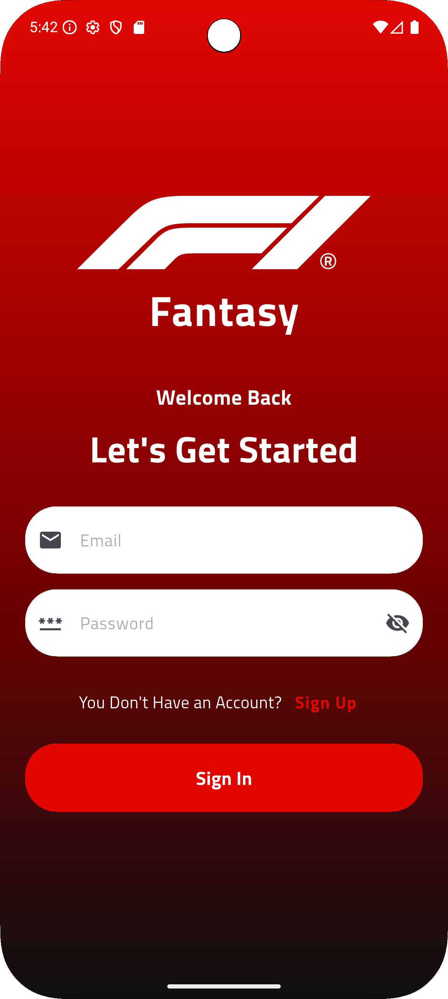 |  | 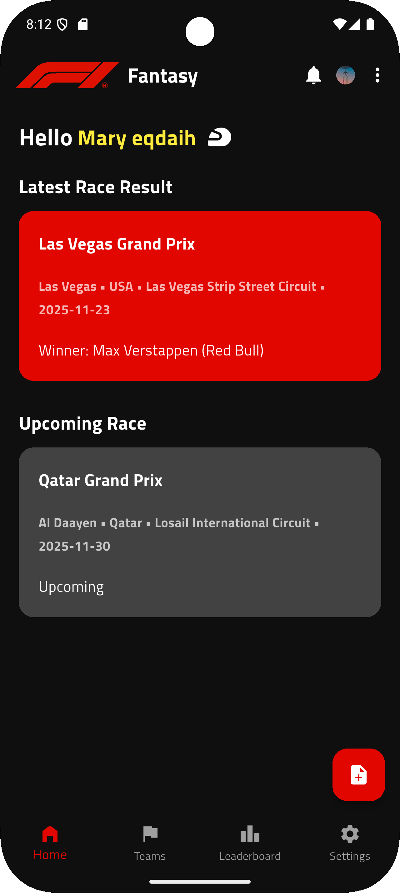 | .png) | 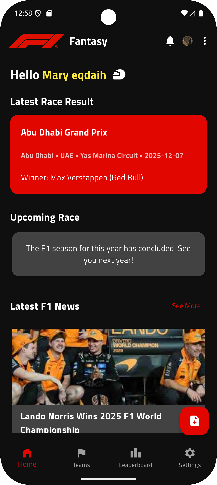 | 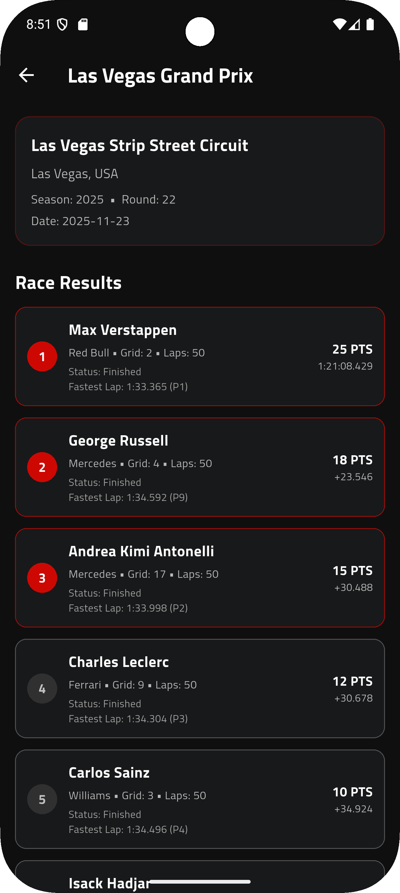 |

| **Teams** | **Team Details** | **Leaderboard** | **Favorites**                                  |
|-----------|------------------|-----------------|------------------------------------------------|
| 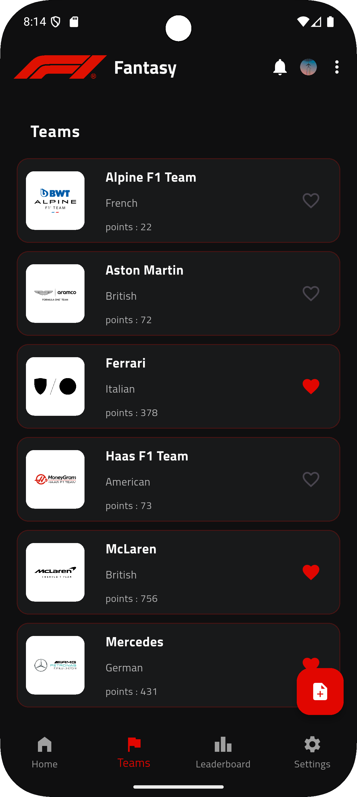 | 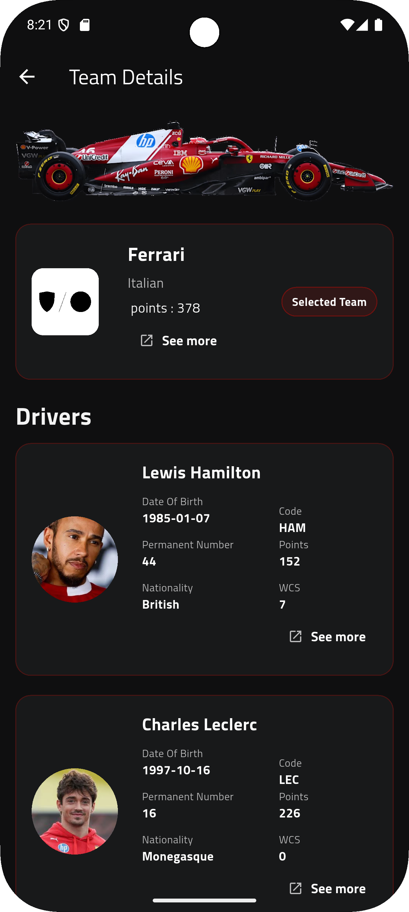 | 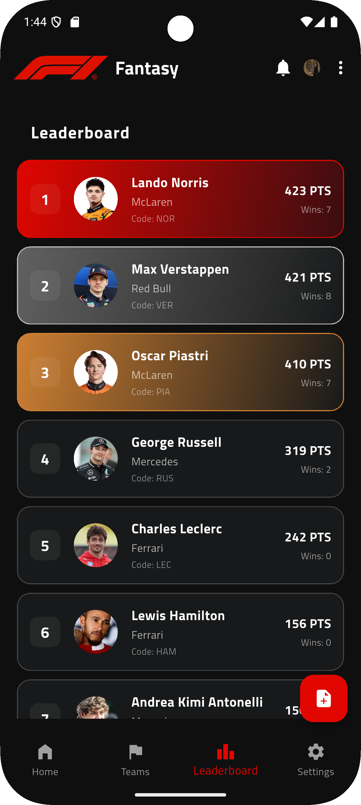 | 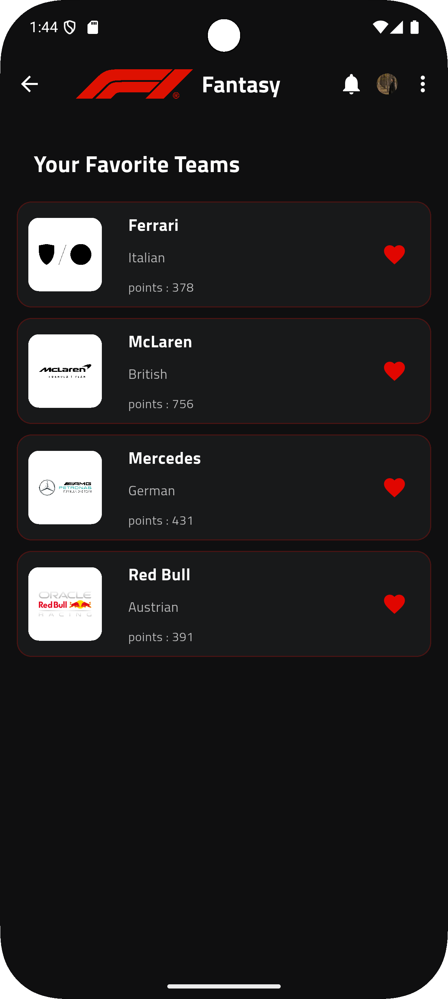 | 

| **Add Note** | **Notes List** | **Edit Note** | **Notes After Edit** |
|--------------|----------------|---------------|----------------------|
|  |  |  |  |

| **Settings** | **Profile** | **Edit Profile **                                    | **About F1**                                 | ** Latest F1 News**                     |
|--------------|-------------|------------------------------------------------------|----------------------------------------------|-----------------------------------------|
| 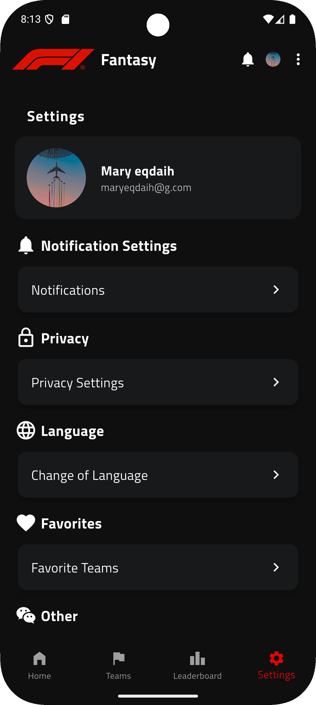 | 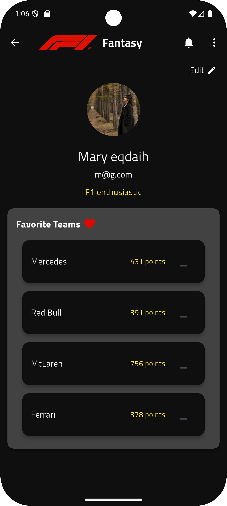 | 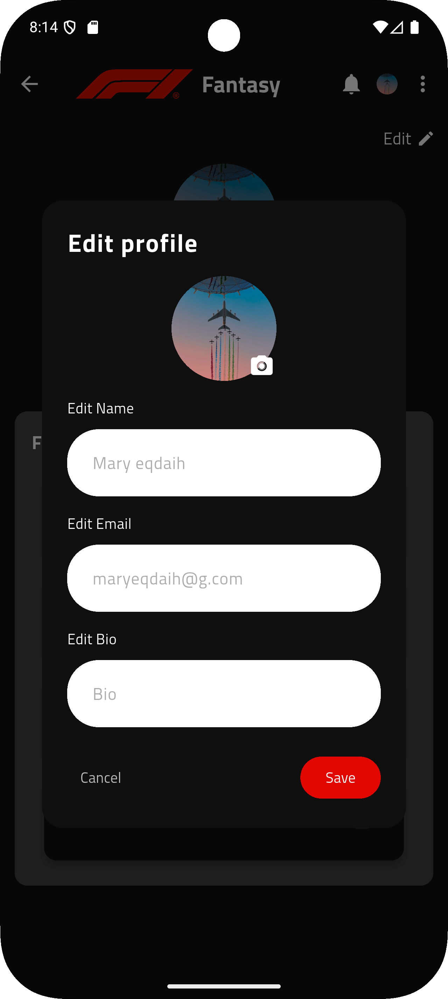 |  | 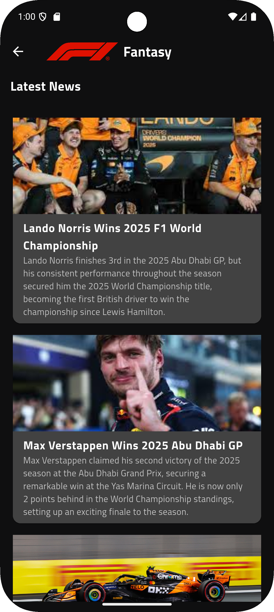 |


---


## ✨ Features

- **User Authentication**: Secure sign-up and sign-in using Firebase Authentication.
- **News Feed**: A dedicated screen showing the latest F1 news.
- **Team & Driver Information**: Browse comprehensive details about all F1 teams and drivers for the current season.
- **Favorites System**: Mark teams as favorites for quick access.
- **Personalized Profile**: A user profile screen displaying user information and their favorite teams.
- **Profile Customization**: Users can edit their name, bio, and profile picture.
- **Modern UI**: A sleek, dark-themed interface inspired by the official Formula 1 branding.

## 🛠️ Technologies Used

- **Framework**: Flutter
- **State Management**: `flutter_bloc` for predictable state management.
- **Backend & Authentication**:
  - `firebase_auth` for user authentication.
  - `cloud_firestore` for storing user profile data.
  - `supabase_flutter` for image storage.
- **Routing**: Custom route management for clear navigation.
- **HTTP Requests**: `http` package for fetching data from the Ergast F1 API.
- **Image Handling**:
  - `image_picker` for selecting profile pictures from the device gallery.
  - `cached_network_image` for efficient loading and caching of network images.
- **Local Storage**: `shared_preferences` for persisting favorite teams locally.
- **UI**:
  - `flutter_svg` for displaying SVG assets.
  - Custom-built widgets for a consistent look and feel.

## 🚀 Getting Started

To get a local copy up and running, follow these simple steps.

### Prerequisites

- Flutter SDK installed on your machine.
- A Firebase project set up with Authentication and Firestore enabled.
- A Supabase project set up with a storage bucket for avatars.

### Installation

1.  **Clone the repo**
    ```sh
    git clone https://github.com/your_username/formula1_fantasy.git
    ```
2.  **Install packages**
    ```sh
    flutter pub get
    ```
3.  **Configure Firebase**
    - Follow the FlutterFire CLI documentation to configure your Flutter app with your Firebase project.
    - Ensure you have a `firebase_options.dart` file in your `lib` directory.

4.  **Configure Supabase**
    - Initialize Supabase in your `main.dart` file with your project URL and anon key.

5.  **Run the app**
    ```sh
    flutter run
    ```

## 📂 Project Structure

The project is structured to separate concerns and improve maintainability:

```
lib/
├── f1/
│   ├── cubit/        # BLoC/Cubit logic for state management
│   ├── data/         # Data sources (API, Firebase, local)
│   ├── presentation/ # UI (screens and widgets)
├── routes/           # Navigation and routing
└── main.dart         # App entry point
```

## 🤝 Contributing

Contributions are what make the open-source community such an amazing place to learn, inspire, and create. Any contributions you make are **greatly appreciated**.

If you have a suggestion that would make this better, please fork the repo and create a pull request. You can also simply open an issue with the tag "enhancement".

1.  Fork the Project
2.  Create your Feature Branch (`git checkout -b feature/AmazingFeature`)
3.  Commit your Changes (`git commit -m '''Add some AmazingFeature''')
4.  Push to the Branch (`git push origin feature/AmazingFeature`)
5.  Open a Pull Request

## 📄 License

Distributed under the MIT License. See `LICENSE` for more information.
