# Formula 1 Fantasy App 🏎️

## 🏁 Introduction

Welcome to the Formula 1 Fantasy App — your ultimate F1 companion built with Flutter. Stay updated with the latest race results and news, explore detailed information about drivers and teams, build your fantasy team, and personalize your experience with full Arabic and English language support.

This project demonstrates modern Flutter development practices including state management with BLoC/Cubit, Firebase + Supabase integration, localization, local storage, and a polished dark-themed UI inspired by official Formula 1 branding.

---

## 📸 UI Screenshots

Dark theme, mobile-first UI — built for F1 fans.

| **Sign In** | **Sign Up** | **Home** | **Upcoming Race**                                              | **Latest Race**                                            | **Fantasy**                                |
|-------------|-------------|----------|----------------------------------------------------------------|------------------------------------------------------------|--------------------------------------------|
| 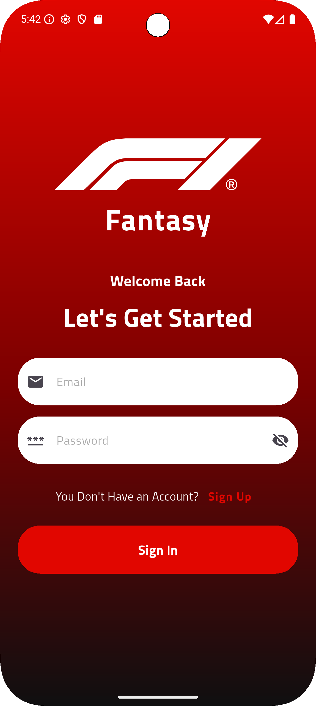 | 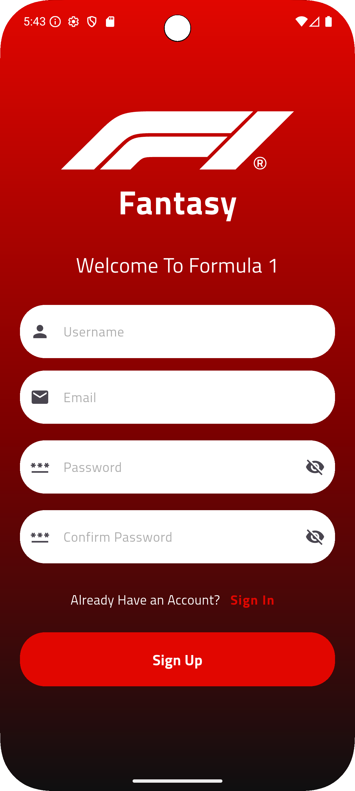 | 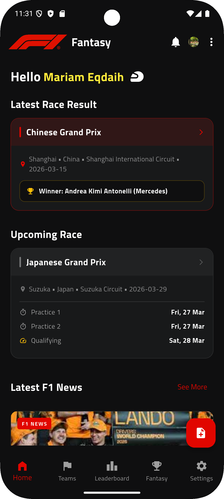 | 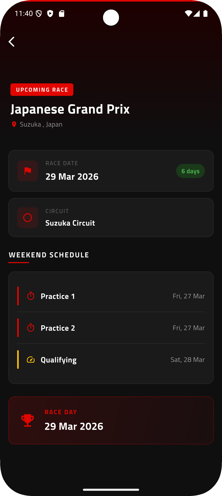 | 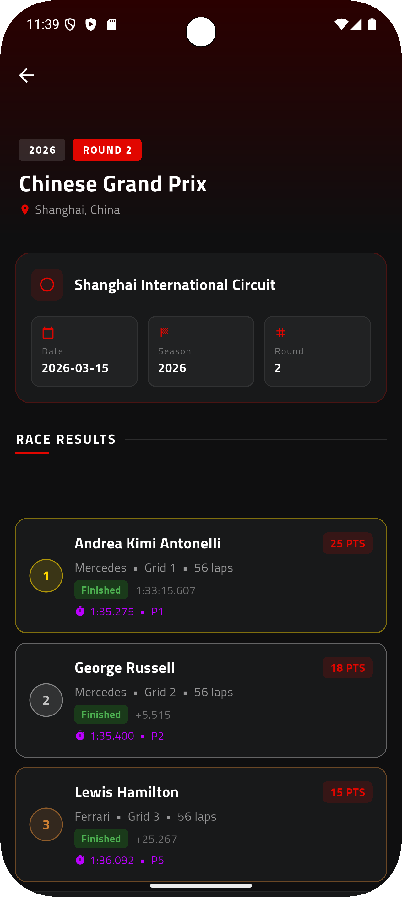 | 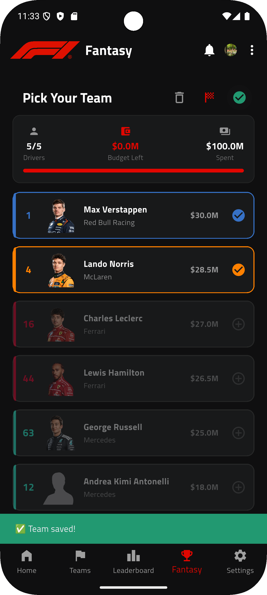 |

| **My Fantasy Team**                                     | **Teams** | **Team Details** | **Leaderboard** | **Favorites**                             |
|---------------------------------------------------------|-----------|------------------|-----------------|-------------------------------------------|
| 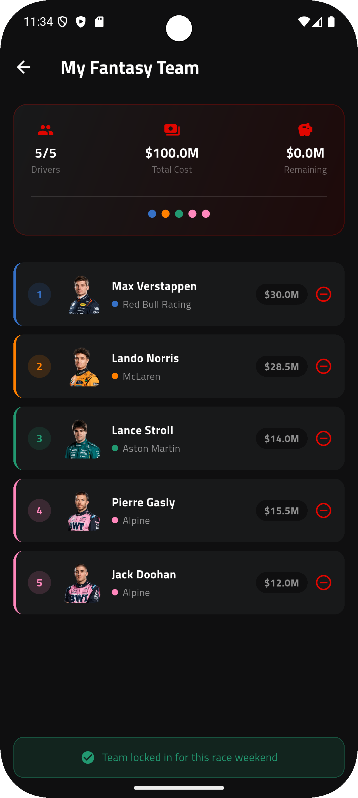 | 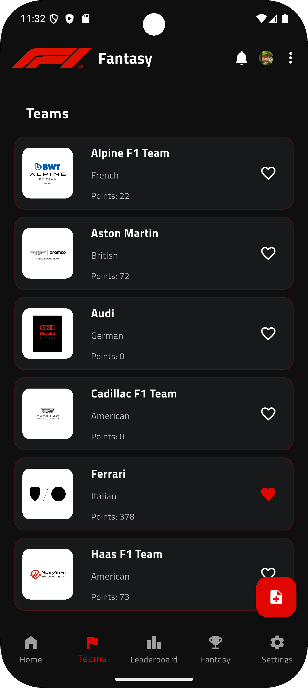 | 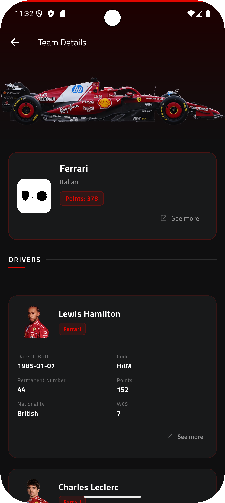 | 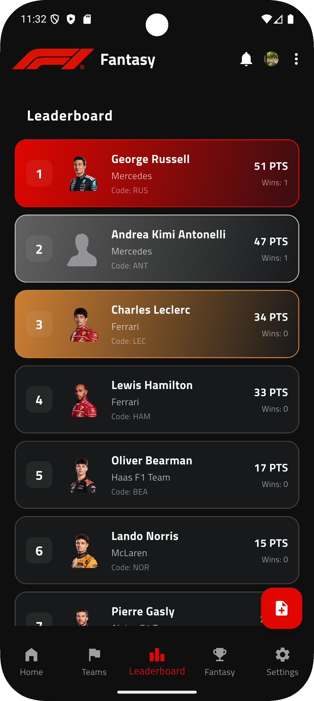 | 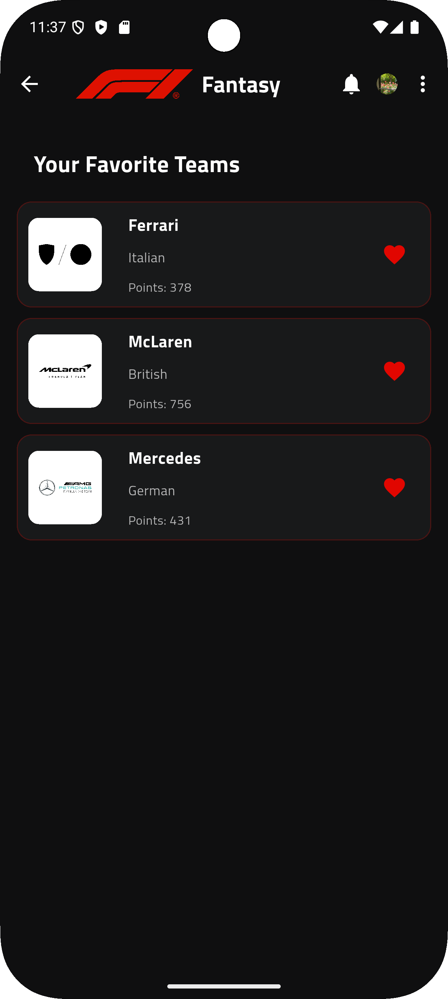 |

| **Settings** | **Delete Account**          | **Languages**                                 | **Profile**                                | **Edit Profile**                                     |
|--------------|-----------------------------|-----------------------------------------------|--------------------------------------------|------------------------------------------------------|
| 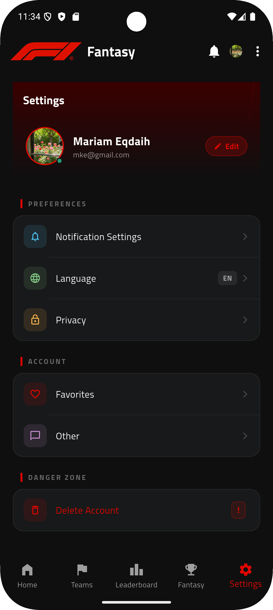 | 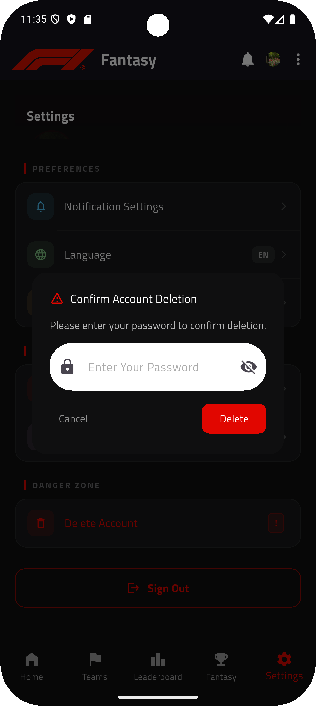 | 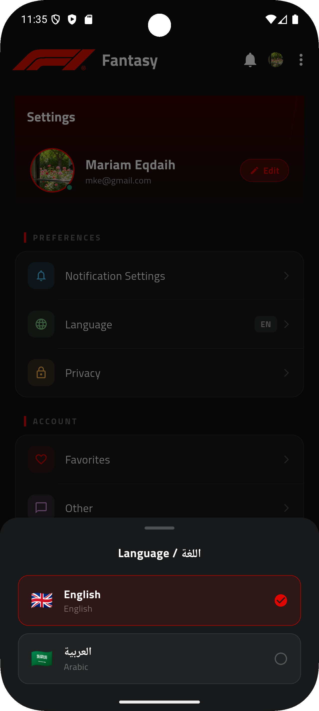 | 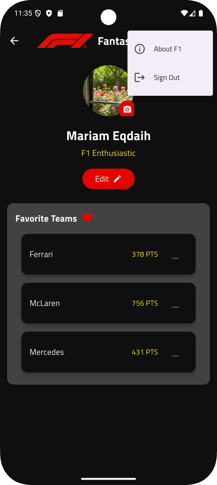 | 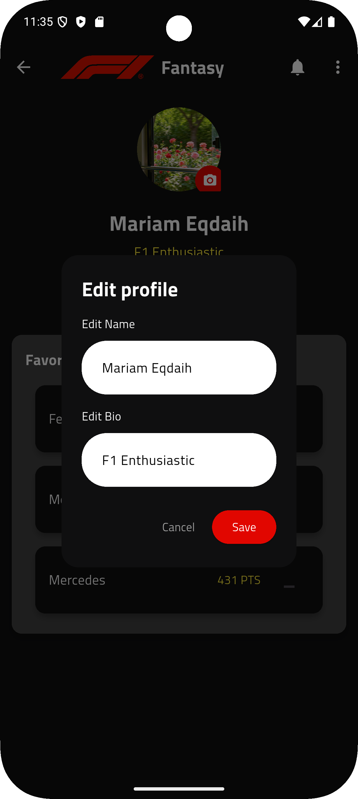 | 

| **About F1**                                 | **Latest F1 News** |
|----------------------------------------------|-------------------|
|  | 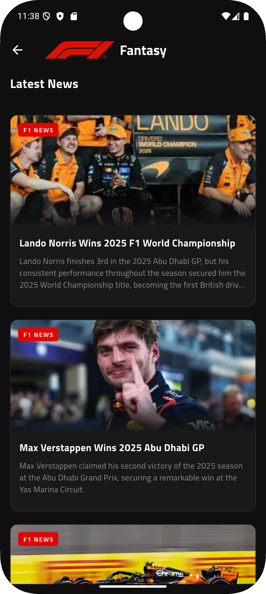 |

---

## ✨ Features

### 🔐 Authentication
- Secure sign-up and sign-in using Firebase Authentication
- Auth state persistence — user stays logged in across app restarts
- Account deletion with password re-authentication for security
- Automatic routing based on auth state — logged in users go to Home, others go to Sign In

### 🏎️ Race & Season Data
- Live upcoming race schedule with all session dates — FP1, FP2, Qualifying, Sprint Qualifying, Sprint Race
- Null-safe handling for sprint weekends (FP2 is absent on sprint weekends)
- Latest race results including winner name and constructor
- Full race details screen with position, driver, constructor, points, laps, finish time, and fastest lap
- Tap upcoming race card to see full session schedule details
- Data sourced from the Jolpica Ergast F1 API (free, no key required)

### 👥 Teams & Drivers
- Browse all 10 current F1 teams with car images, logos, nationalities, and championship points
- Team details screen with a hero car image header
- Each team shows both of its current drivers with full stats — date of birth, permanent number, nationality, driver code, points, and world championship wins
- Direct Wikipedia link for every driver and team
- Driver standings leaderboard with rank badges — gold for 1st, silver for 2nd, bronze for 3rd

### ⭐ Fantasy Team
- Pick exactly 5 drivers from the full 2025 grid within a $100M budget
- Real-time budget tracker with a color-coded progress bar (orange → red as budget fills)
- Drivers are disabled when budget is insufficient or team is full
- Animated selection state — drivers show a team-colored checkmark when selected
- Save team to local storage — persists across sessions
- My Team screen shows selected drivers with position badges and team color accents
- Team status badge — green when saved, orange when unsaved
- Clear team button to start over

### 📰 News
- Curated F1 news feed on the home screen
- Full news list screen accessible from "See More"
- News content is fully translated — separate English and Arabic article lists

### 📝 Notes
- Personal notes with title and content
- Add, edit, and delete notes
- Persisted locally using SQLite — notes survive app restarts without any network connection

### 👤 Profile
- View name, email, and bio
- Upload and update profile photo from device gallery (stored on Supabase Storage)
- Edit name and bio inline via a dialog
- Favorite teams displayed directly on profile
- Pull-to-refresh to reload profile data

### ❤️ Favorites
- Mark and unmark teams as favorites from the Teams screen or Favorites screen
- Red border highlight on favorited team cards
- Favorites persist using SharedPreferences — survive app restarts
- Favorite teams shown on the Profile screen

### 🌐 Localization 
- Full UI translation using Flutter's official ARB localization system
- Right-to-left layout automatically applied for Arabic
- API data translated using static lookup maps covering:
   - All 24 race names (e.g. `Japanese Grand Prix` → `جائزة اليابان الكبرى`)
   - Circuit names (e.g. `Suzuka Circuit` → `حلبة سوزوكا`)
   - Locations/countries (e.g. `Japan` → `اليابان`, `Shanghai` → `شنغهاي`)
   - All 10 team names (e.g. `Ferrari` → `فيراري`)
   - All 20 driver names (e.g. `Max Verstappen` → `ماكس فيرستابن`)
   - Nationalities (e.g. `British` → `بريطانية`)
- Session labels translated (FP1 → التدريب الأول, Qualifying → التأهل, etc.)
- Date formatting localized — English (`Fri, 27 Mar`) and Arabic (`الجمعة، 27 مارس`)
- Language preference saved to SharedPreferences and loaded before `runApp()` — no flicker on restart

### ⚙️ Settings
- Collapsing hero header with profile photo, name, email, and edit shortcut
- Settings items grouped into sections: Preferences, Account, Danger Zone
- Each item has a colored icon box for visual distinction
- Language picker bottom sheet with animated selection cards and checkmarks
- Current language shown as a badge on the language tile (EN / AR)
- Sign out clears auth state and navigates to Sign In
- Delete account requires password confirmation before permanent deletion

---

## 🛠️ Technologies Used

| Category | Technology | Purpose |
|---|---|---|
| Framework | Flutter | Cross-platform mobile development |
| State Management | `flutter_bloc` (Cubit) | Predictable state across all screens |
| Authentication | `firebase_auth` | Sign up, sign in, delete account |
| Cloud Database | `cloud_firestore` | User profile data (name, bio, photo URL) |
| Image Storage | `supabase_flutter` | Profile photo upload and retrieval |
| Local Database | SQLite via `sqflite` | Notes — offline, no network needed |
| Local Storage | `shared_preferences` | Favorites, fantasy team, language preference |
| F1 API | Jolpica Ergast API + `http` | Race schedule, results, standings, drivers |
| Localization | Flutter ARB + `flutter_localizations` | Full Arabic/English UI translation |
| Image Handling | `image_picker` | Select profile photo from gallery |
| Image Caching | `cached_network_image` | Efficient network image loading |
| SVG Support | `flutter_svg` | Team logos in SVG format |
| URL Launching | `url_launcher` | Open Wikipedia links in-app browser |

---

## 📂 Project Structure

```
lib/
├── f1/
│   ├── cubit/                       # All BLoC/Cubit state management
│   │   ├── auth_cubit.dart          # Sign in, sign up, sign out, delete
│   │   ├── drivers_cubit.dart       # Fetch drivers by constructor
│   │   ├── fantasy_cubit.dart       # Fantasy team selection + budget
│   │   ├── favs_cubit.dart          # Favorite teams management
│   │   ├── notes_cubit.dart         # Notes CRUD
│   │   ├── profile_cubit.dart       # Fetch, update, upload profile
│   │   ├── standings_cubit.dart     # Driver standings leaderboard
│   │   └── teams_cubit.dart         # Fetch all F1 teams
│   ├── data/
│   │   ├── local/
│   │   │   ├── local_storage.dart   # SharedPreferences — favorites, fantasy, language
│   │   │   ├── notes_DB.dart        # SQLite database for notes
│   │   │   └── translations.dart    # Static maps for translating API data
│   │   ├── models/                  # Data models
│   │   │   ├── driver_model.dart
│   │   │   ├── driver_standings_model.dart
│   │   │   ├── fantasy_model.dart   # Fantasy driver data + FantasyDriverData list
│   │   │   ├── news_model.dart
│   │   │   ├── profile_model.dart
│   │   │   ├── race_details_model.dart
│   │   │   ├── race_info_model.dart
│   │   │   └── teams_model.dart
│   │   └── remote/
│   │       ├── driver_standings_api.dart
│   │       ├── drivers_api.dart
│   │       ├── f1_api.dart          # Latest race, next race, race details
│   │       └── firebase/            # Firestore profile operations
│   └── presentation/
│       ├── screens/
│       │   ├── aboutF1/
│       │   ├── auth/                # sign_in.dart, sign_up.dart
│       │   ├── fantasy/             # fantasy.dart, my_team.dart
│       │   ├── favorites/
│       │   ├── home/                # home.dart, home_screen.dart (shell)
│       │   ├── leaderboard/
│       │   ├── news/
│       │   ├── notes/               # notes.dart, add_note.dart
│       │   ├── notifications/
│       │   ├── profile/
│       │   ├── raceDetails/         # latest_race_details.dart, upcoming_race_details.dart
│       │   ├── settings/
│       │   │   ├── settings.dart
│       │   │   └── widgets/         # Extracted settings widget classes
│       │   │       ├── settings_tile.dart
│       │   │       ├── settings_group.dart
│       │   │       ├── settings_section_label.dart
│       │   │       └── language_option.dart
│       │   └── teams/               # teams.dart, teams_details.dart
│       └── widgets/                 # Shared reusable widgets
│           ├── budget_banner.dart
│           ├── driver_card.dart
│           ├── driver_widget.dart
│           ├── leaderboard_widget.dart
│           ├── news_card_widget.dart
│           ├── race_widget.dart
│           ├── team_driver_tile.dart
│           ├── team_status_badge.dart
│           ├── team_summary_header.dart
│           └── teams_widget.dart
├── l10n/                            # Localization
│   ├── app_en.arb                   # English strings
│   ├── app_ar.arb                   # Arabic strings
│   └── app_localizations.dart       # Generated — do not edit manually
├── routes/
│   └── routes.dart                  # Named route constants
└── main.dart                        # Entry point, locale init, providers
```

---

## 🌍 Localization Architecture

The app uses a two-layer translation approach to handle both static UI text and dynamic API data.

**Layer 1 — ARB files** handle all hardcoded UI strings:
```dart
l10n.settingsTitle         // "Settings"      →  "الإعدادات"
l10n.homeUpcomingRace      // "Upcoming Race"  →  "السباق القادم"
l10n.upcomingQualifying    // "Qualifying"     →  "التأهل"
l10n.driverNationality     // "Nationality"    →  "الجنسية"
```

**Layer 2 — `translations.dart` maps** handle dynamic API strings:
```
translateRaceName(context, 'Japanese Grand Prix')  // → "جائزة اليابان الكبرى"
translateCircuit(context, 'Suzuka Circuit')        // → "حلبة سوزوكا"
translateLocation(context, 'Japan')               // → "اليابان"
translateTeam(context, 'Ferrari')                 // → "فيراري"
translateDriver(context, 'Max Verstappen')        // → "ماكس فيرستابن"
translateNationality(context, 'British')          // → "بريطانية"
```

All helpers fall back to the original English string if a key is missing — the app never crashes or shows blank text due to a missing translation.


---

## 🏗️ Architecture & Design Decisions

### State Management — Cubit
Every feature has its own Cubit with dedicated states. UI never calls APIs or databases directly — it only reads state and calls Cubit methods.

```
UI → Cubit.someMethod() → API/DB → emit(NewState) → UI rebuilds
```

### Firebase + Supabase Bridge
Firebase Auth handles authentication. Supabase handles image storage. Since Supabase needs its own JWT, the app bridges the two:
```
FirebaseAuth.instance.idTokenChanges().listen((user) {
  if (user != null) {
    user.getIdToken().then((jwt) {
      Supabase.instance.client.auth.setSession(jwt);
    });
  }
});
```

### Shared FantasyCubit
The Fantasy screen and My Team screen share the same `FantasyCubit` instance using `BlocProvider.value` — so both screens always reflect the same team state without duplication.

### Null-safe API Parsing
The Jolpica API returns some fields as strings instead of integers, and sprint weekends have missing fields. All parsing uses null-safe operators:
```
int.tryParse(json['position'] as String? ?? '0') ?? 0
race['SecondPractice']?['date']  // null on sprint weekends
```

### Reusable Widget Classes
Repeated UI patterns are extracted into standalone widget classes rather than helper methods — making them reusable across screens, individually testable, and visible by name in Flutter DevTools.

---

## 🚀 Getting Started

### Prerequisites
- Flutter SDK (3.x or later)
- Firebase project with Authentication and Firestore enabled
- Supabase project with a public storage bucket named `avatars`

### Installation

1. **Clone the repo**
   ```sh
   git clone https://github.com/Mary-Eqdaih/Formula1-Fantasy.git
   ```

2. **Install packages**
   ```sh
   flutter pub get
   ```

3. **Generate localization files**
   ```sh
   flutter gen-l10n
   ```

4. **Configure Firebase**
   - Use the FlutterFire CLI to connect your Firebase project
   - Ensure `firebase_options.dart` exists in `lib/`

5. **Configure Supabase**
   - Add your project URL and anon key in `main.dart`
   - Create a storage bucket named `avatars` and set it to public

6. **Run the app**
   ```sh
   flutter run
   ```

---

## 📡 API Reference

The app uses the **Jolpica Ergast F1 API** — a free, open F1 data API with no API key required.

| Endpoint | Used for |
|---|---|
| `/f1/current/last/results.json` | Latest race winner and result |
| `/f1/current/next.json` | Next race schedule and session dates |
| `/f1/current/driverStandings.json` | Full driver standings leaderboard |
| `/f1/current/constructors/{id}/drivers.json` | Drivers for a specific team |

Base URL: `https://api.jolpi.ca/ergast`

---

## 💾 Local Storage Reference

All local persistence uses `SharedPreferences` (key-value) and SQLite (structured data) via `LocalStorageData`:

| Key | Type | Stores |
|---|---|---|
| `favoriteTeams` | `List<String>` | IDs of favorited teams |
| `fantasy_team` | `String` (JSON) | List of selected driver IDs |
| `app_locale` | `String` | Language code — `'en'` or `'ar'` |
| SQLite `notes` table | Rows | Note title, content, timestamps |